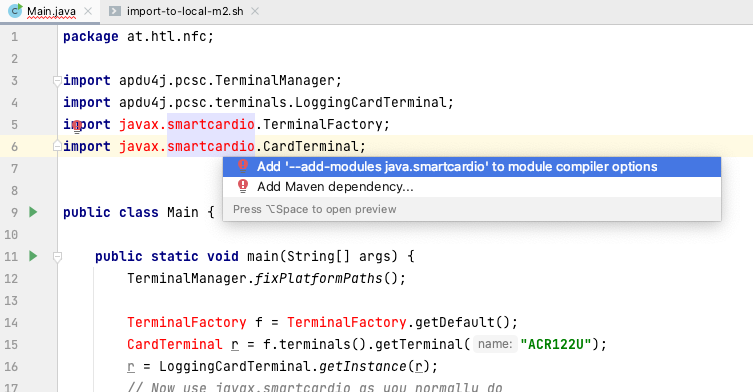
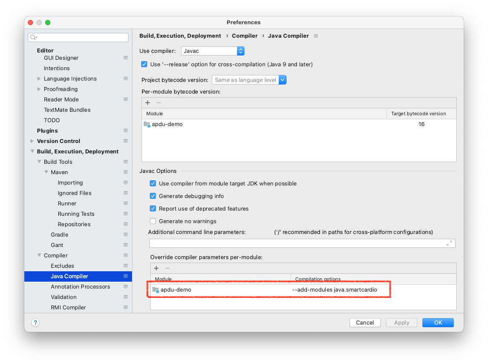

# apdu-demo

- This example is based on https://github.com/martinpaljak/apdu4j
- Thank you Mr. Martin Paljak for providing this great api

## Preparations for importing the smartcard-libs

### Import apdu4j-library into your local maven repository

- Run script 
  ```
  ./import-to-local-m2.sh
  ```
  
  This script downloads the apdu4j-library and installs it into your local maven repository
  (the `.m2`-folder in your home-dir)
  
  Pay attention to the 'BUILD SUCCESS'

  ```
  [INFO] Installing /var/folders/wy/v1wsts4940v93fqgmtcspfth0000gn/T/mvninstall13594789157748152326.pom to /Users/stuetz/.m2/repository/com/github/martinpaljak/apdu4j/21.04.12/apdu4j-21.04.12.pom
  [INFO] ------------------------------------------------------------------------
  [INFO] BUILD SUCCESS
  [INFO] ------------------------------------------------------------------------
  [INFO] Total time:  0.230 s
  [INFO] Finished at: 2021-04-21T09:40:48+02:00
  [INFO] ------------------------------------------------------------------------
  ```

### Add dependency to pom.xml

  ```
   <dependency>
     <groupId>com.github.martinpaljak</groupId>
     <artifactId>apdu4j</artifactId>
     <version>21.04.12</version>
   </dependency>

  ```

### Add compiler - options to include smartcard-io 





## Simple Code

```
package at.htl.nfc;

import apdu4j.pcsc.TerminalManager;
import apdu4j.pcsc.terminals.LoggingCardTerminal;
import javax.smartcardio.TerminalFactory;
import javax.smartcardio.CardTerminal;

public class Main {

    public static void main(String[] args) {
        TerminalManager.fixPlatformPaths();

        TerminalFactory f = TerminalFactory.getDefault();
        CardTerminal r = f.terminals().getTerminal("ACR122U");
        r = LoggingCardTerminal.getInstance(r);
        // Now use javax.smartcardio as you normally do
    }
}
```

## Some Links

- [Proximity card (BIBO)](https://www.ssatp.org/sites/ssatp/files/publications/Toolkits/Fares%20Toolkit%20content/fare-collection-technologies/smart-cards/proximity-card-(bibo).html)

